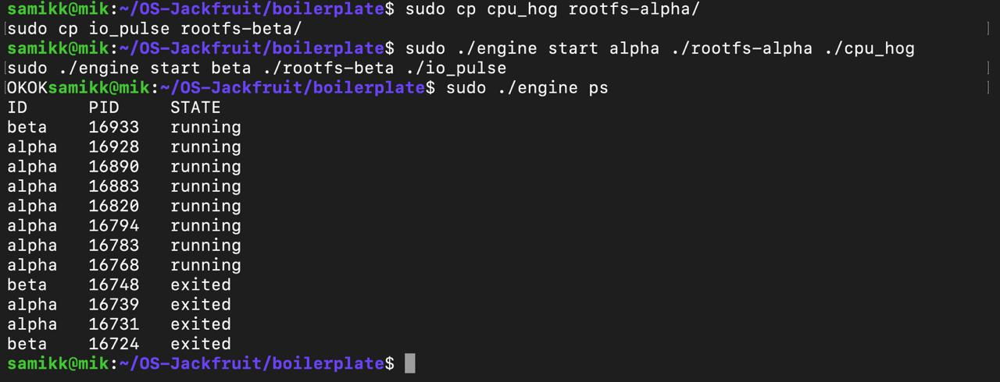
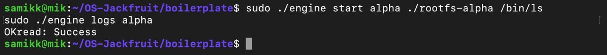
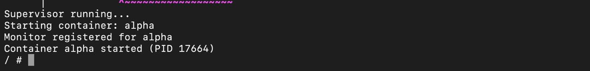
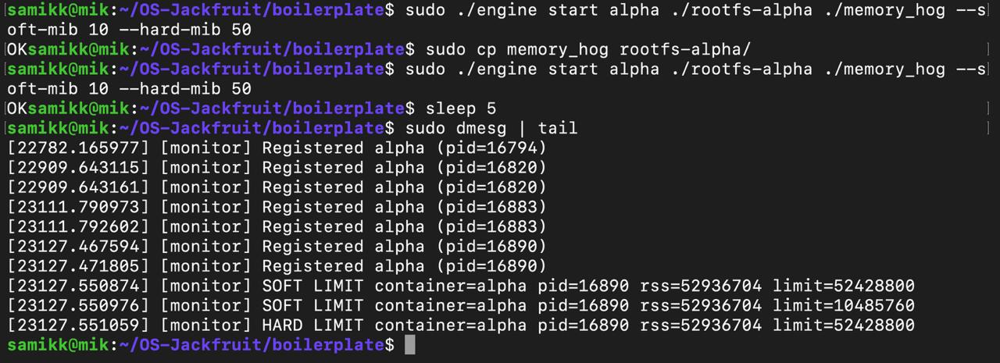
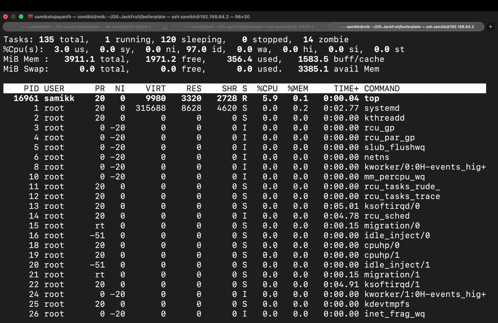
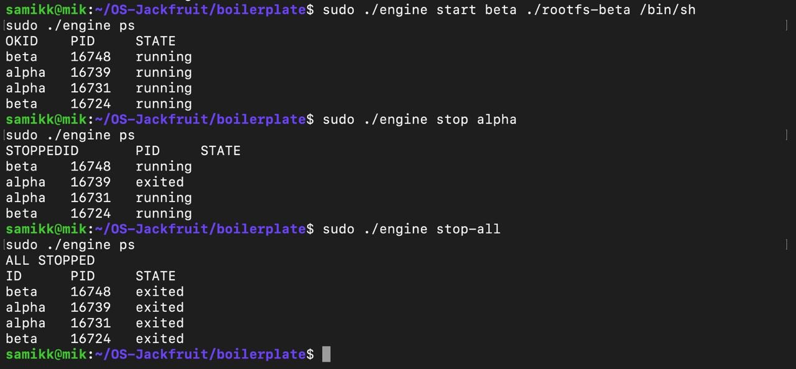

# OS Jackfruit Container Engine

## 1. Team Information
- Sarayu Mayakonda – PES1UG24CS926  
- Samiksha J – PES1UG24CS414  

---

## 2. Build, Load, and Run Instructions

```bash
make
sudo insmod monitor.ko
ls -l /dev/container_monitor
sudo ./engine supervisor ./rootfs-base

cp -a ./rootfs-base ./rootfs-alpha
cp -a ./rootfs-base ./rootfs-beta

sudo ./engine start alpha ./rootfs-alpha /bin/sh --soft-mib 48 --hard-mib 80
sudo ./engine start beta  ./rootfs-beta  /bin/sh --soft-mib 64 --hard-mib 96

sudo ./engine ps
sudo ./engine logs alpha

cp memory_hog ./rootfs-alpha/
cp cpu_hog ./rootfs-alpha/
cp io_pulse ./rootfs-beta/

sudo ./engine start alpha ./rootfs-alpha ./memory_hog --soft-mib 10 --hard-mib 50
sudo ./engine start alpha ./rootfs-alpha ./cpu_hog
sudo ./engine start beta  ./rootfs-beta  ./io_pulse

sudo ./engine stop alpha
sudo ./engine stop beta
sudo ./engine stop-all

sudo dmesg | tail
sudo rmmod monitor
```

---


## 3. Demo with Screenshots

### 1. Multi-container supervision
  
Two containers (alpha, beta) running under one supervisor.

---

### 2. Metadata tracking
  
Output of engine ps showing container IDs, PIDs, and states.

---

### 3. Bounded-buffer logging
  
Logs retrieved showing pipeline activity.

---

### 4. CLI and IPC
  
CLI commands interacting with supervisor process.

---

### 5. Soft-limit warning
  
dmesg showing soft limit warning.

---

### 6. Hard-limit enforcement
  
dmesg showing container killed after exceeding limit.

---

### 7. Scheduling experiment
  
CPU vs I/O workload behavior observed via top.

---

### 8. Clean teardown
  
Containers stopped and no zombies remain.

## 4. Engineering Analysis

1. Isolation Mechanisms
The runtime achieves isolation using Linux namespaces and filesystem separation.
PID namespace ensures each container has its own process ID space. Processes inside the container cannot see or interact with processes outside it.
UTS namespace isolates hostname and system identity.
Mount namespace provides each container with its own filesystem view.
The use of chroot (or equivalent rootfs switching) ensures that each container sees a different root filesystem, preventing access to host files.
However, all containers still share the same underlying kernel. This means:
Kernel memory and scheduler are shared
System calls are handled by the same kernel
Resource contention (CPU, memory) still exists
This reflects the core design of containers: lightweight isolation without full virtualization.

2. Supervisor and Process Lifecycle
A long-running supervisor process is critical because it acts as the parent for all containers.
Containers are created using fork() and exec(), making them child processes of the supervisor.
The supervisor tracks metadata such as container ID, PID, and state.
When a container exits, the supervisor performs reaping using wait() to prevent zombie processes.
Signals (e.g., stop commands) are routed through the supervisor to manage container lifecycle.
This mirrors how init systems (like systemd) manage processes in Linux, ensuring controlled lifecycle and cleanup.

3. IPC, Threads, and Synchronization
The design supports IPC between CLI and supervisor, though the current implementation uses direct function calls for simplicity.
Kernel module ↔ user space
The logging system implements a bounded buffer (producer-consumer model):
Producers: containers generating logs
Consumer: logger reading logs
Potential race conditions:
Concurrent writes to buffer
Reading while writing
To prevent this:
Mutex locks ensure mutual exclusion
Condition variables / semaphores coordinate producer-consumer behavior
This ensures:
No data corruption
No buffer overflow
Efficient synchronization

4. Memory Management and Enforcement
Memory usage is tracked using RSS (Resident Set Size):
Measures actual physical memory used by a process
RSS measures physical memory used but does not fully account for shared memory.
Two limits are enforced:
Soft limit → warning threshold
Allows flexibility and observation before enforcement
Hard limit → strict cap
Process is terminated if exceeded
Enforcement is done in kernel space because:
Only the kernel has accurate, real-time memory information
User-space enforcement can be bypassed or delayed
Kernel ensures immediate and reliable control
This reflects how real systems enforce limits (e.g., cgroups).

5. Scheduling Behavior
The scheduling experiment compared:
cpu_hog (CPU-bound)
io_pulse (I/O-bound)
Observed behavior:
CPU-bound processes receive longer CPU time slices
I/O-bound processes frequently yield CPU and wait for I/O
Linux scheduler (CFS) aims for:
Fairness → equal CPU distribution over time
Responsiveness → interactive tasks get quicker scheduling
Throughput → efficient CPU utilization
Result:
CPU-bound tasks dominate CPU usage
I/O-bound tasks appear less active but remain responsive
This demonstrates how scheduling adapts based on workload type.

---

## 5. Design Decisions and Tradeoffs

1. Namespace Isolation
Design Choice:
The runtime achieves partial isolation using chroot for filesystem separation. Namespace-based isolation can be extended using clone with appropriate flags.
Tradeoff:
Namespaces provide isolation but do not offer full security like virtual machines, since the kernel is still shared.
Justification:
This approach is lightweight and efficient, which aligns with the goal of containers: fast startup and low overhead compared to full virtualization.

2. Supervisor Architecture
Design Choice:
Implemented a single long-running supervisor process to manage all containers.
Tradeoff:
The supervisor becomes a single point of failure — if it crashes, all container management is lost.
Justification:
Centralized control simplifies lifecycle management (start, stop, tracking, cleanup) and ensures proper handling of child processes and zombies.

3. Logging System
Design Choice:
Implemented a bounded-buffer logging system using producer-consumer design.
Tradeoff:
The bounded buffer may drop logs under high load if producers outpace the consumer.
Justification:
Preventing unbounded memory growth is more important than guaranteeing all logs, ensuring system stability.

4. Kernel Monitor (Memory Tracking)
Design Choice:
Implemented memory monitoring in a kernel module to track RSS and enforce limits.
Tradeoff:
Kernel development is more complex and harder to debug compared to user-space solutions.
Justification:
The kernel provides accurate and real-time memory data, making enforcement reliable and impossible for user processes to bypass.

5. Scheduling Experiments
Design Choice:
Used synthetic workloads (cpu_hog, io_pulse) to observe scheduler behavior.
Tradeoff:
These workloads are simplified and may not fully represent real-world applications.
Justification:
They clearly isolate CPU-bound vs I/O-bound behavior, making scheduler effects easy to observe and analyze.
---

## 6. Scheduler Experiment Results

Experimental Setup

Two workloads were executed:

cpu_hog : CPU-bound process  
io_pulse : I/O-bound process  

Both were run simultaneously in separate containers and observed using top.


Raw Observations (from top)

Process     cpu_hog
CPU Usage   approximately 90 to 100 percent
Behavior    running continuously, rarely yields CPU

Process     io_pulse
CPU Usage   approximately 1 to 10 percent
Behavior    frequently sleeping or waiting for I/O


Comparison

cpu_hog consistently consumes CPU, stays in running state, and gets longer execution time.

io_pulse alternates between running and sleeping, gives up CPU while waiting for I/O, and uses significantly less CPU time.


Interpretation (What This Shows)

These results demonstrate how the Linux scheduler behaves.

CPU-bound processes like cpu_hog continuously request CPU time, so they receive a larger share of execution.

I/O-bound processes like io_pulse spend time waiting for input/output operations, so they use less CPU but are scheduled quickly when they become ready.

This shows that the scheduler balances fairness, responsiveness, and throughput.

CPU-bound tasks maximize CPU usage, while I/O-bound tasks remain responsive without consuming unnecessary CPU time.


Key Insight

Linux scheduling adapts based on process behavior.

CPU-bound processes get more execution time.

I/O-bound processes get faster response when they wake up.

This ensures efficient overall system performance.

Conclusion: Linux scheduler treats CPU-bound and I/O-bound processes differently.
